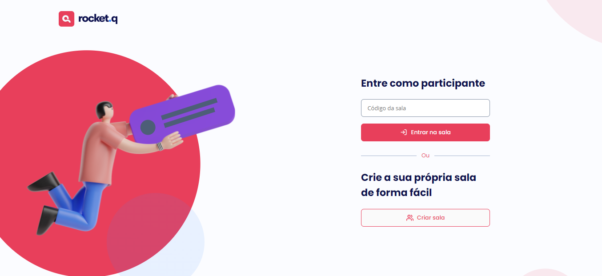

## NLW6 - TRILHA DISCOVER

  

## Um pouco do Projeto:

➡ Projeto desenvolvido na Next Level Week 6 - Together da RocketSeat na Trilha Discover
➡ Um site com a funcionalidade de cadastro de salas por usuários que irá gerar um código único que pode ser enviado para outros usuários acessarem a sala e poderem enviar perguntas anônimas pra o dono da sala que poderá controla-las marcando-as como lida ou excluir ela com a autenticação da senha criado ao iniciar a sala

## Conteúdos

- [Overview](#overview)
  - [Como rodar o projeto](#como-rodar-o-projeto)
  - [Como utilizar](#como-utilizar-o-projeto)
  - [Screenshot](#screenshot)
  - [Links](#links)
- [Processo](#processo)
  - [Contruido com](#construido-com)
  - [Tecnologia utilizadas](#tecnologias-utilizadas)
  - [O que eu aprendi](#oque-eu-aprendi)
  - [Continuação do desenvolvimento](#continuacao-do-desenvolvimento)
  - [Recursos úteis](#recursos-uteis)
- [Autor](#autor)

## Overview

### Como rodar o projeto

 1. Primeiramente é necessário ter o node js instalado, com o node instalado
 2. Clone o projeto com `git clone https://github.com/glsvitoria/nlw6-trilha-discover`
 3. Após clonar o projeto, no console do seu editor de código digite o seguinte comando `npm install` para instalar todas as dependencias
 4. E em seguida use `npm start` para iniciar o projeto :D

### Como utilizar

 1. Crie uma sala (ou entre em uma com o código compartilhado)
 2. Cadastre uma senha para ser usada futuramente no gerenciamento das perguntas
 3. Enviei o código para que os amigos possam acessar a sala e enviar perguntas

### Screenshot

  
### Links
 - Site hospedado: [Rocket.q](https://rocket-question.herokuapp.com/)

## Processo

### Tecnologias utilizadas:

### O que eu aprendi

- Criação de sites multipáginas
- Integração do front-end e do back-end
- Utilização de tecnologias back-end como NodeJS, Express e do banco de dados SQLite

### Continuação do desenvolvimento

- Pretendo futuramente tentar colocar o site hospedando se ouver alguma forma

## Autor
- Linkedin - [Guilherme Vitória](https://www.linkedin.com/in/glsvitoria/)
- GitHub - [glsvitoria](https://github.com/glsvitoria)
- Instagram - [glsvitoria](https://www.instagram.com/glsvitoria/)
